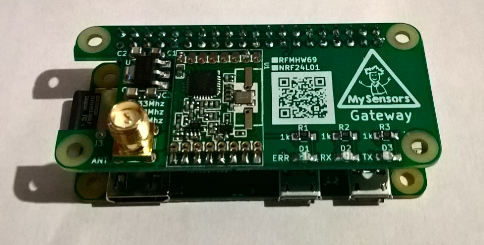

[:fr:](LISEZMOI.md) [:uk:](README.md)

MySensorsPiGw
=============
Passerelle MySensors RFM69 &amp; NRF24L pour Raspberry Pi (zero &amp; B)

Voir
https://www.mysensors.org/build/raspberry

Version:

v1
- mauvaise largeur pour la piste antenne

v2
- Modification de la largeur de la piste antenne
- ajout d'un régulateur 3.3v
- ajout de  C1, C2, C3, C4

v3 
- ajout d'un second NRF24L01 sur SPI1
- ajout des condensateurs C5 C6
- ajout des leds de status D4 D5 D6
- déplacement de J3

Schemas
-------

PCB
---

RFM69HW 
-------
RFM69HW est connecté au SPI0

Télécharger la branch de developpement

    git clone https://github.com/mysensors/MySensors.git --branch development
    cd MySensors

configurer (passerelle Ethernet)

    ./configure --my-transport=rfm69 --my-rfm69-frequency=868 --my-is-rfm69hw --my-port=5003 --my-leds-err-pin=12 --my-leds-rx-pin=16 --my-leds-tx-pin=18
    make
    
execution

    sudo ./bin/mysgw -d
    
installation

    sudo make install
    
NRF24L01 on SPI0
----------------
Télécharger la branche principale

    git clone https://github.com/mysensors/MySensors.git --branch master
    cd MySensors

configurer (passerelle Ethernet)

    ./configure --my-transport=nrf24 --my-rf24-irq-pin=15 --my-port=5003 --my-leds-err-pin=12 --my-leds-rx-pin=16 --my-leds-tx-pin=18
    make

execution

    sudo ./bin/mysgw -d

installation

    sudo make install

NRF24L01 on SPI1
----------------

C'est experimental, voir https://forum.mysensors.org/topic/7702/double-spi-radio-raspberry-pi

dans le fichier /boot/config.txt ajouter 

    //*** uncomment for pi3 ***
    //dtoverlay=pi3-disable-bt
    
    dtparam=spi=on
    //change spi1 cs0 to gpio16 pin 36
    dtoverlay=spi1-1cs,cs0_pin=16  

copier le répertoire source

    cp -r MySensors MySensorsSecond
    cd MySensorsSecond

editer le fichier `Makefile` : remplacer la chaine de caractères `mysgw` par `mysgwSecond` (avec nano utiliser Ctrl + \ )

copier les fichiers `initscripts/mysgw.systemd` et `initscripts/mysgwSecond.sysvinit` en `initscripts/mysgwSecond.systemd` et `initscripts/mysgwSecond.sysvinit` 
    
    cp initscripts/mysgw.systemd initscripts/mysgwSecond.systemd
    cp initscripts/mysgwSecond.sysvinit initscripts/mysgwSecond.sysvinit
    
editer les fichiers `initscripts/mysgwSecond.systemd` et `initscripts/mysgwSecond.sysvinit` : remplacer la chaine de caractères `mysgw` par `mysgwSecond` (avec nano utiliser Ctrl + \ ) et remplacer la chaine de caractères `MySensors Gateway` par `MySensors Gateway 2`

copier  le fichier mysgw.cpp en mysgwSecond.cpp 

    cp examples_linux/mysgw.cpp examples_linux/mysgwSecond.cpp

configurer la seconde instance 

    ./configure --my-transport=nrf24 --my-rf24-irq-pin=33 --my-rf24-ce-pin=37 --my-rf24-cs-pin=36 --spi-spidev-device=/dev/spidev1.0 --spi-driver=SPIDEV --my-port=5004 --my-leds-err-pin=29 --my-leds-rx-pin=31 --my-leds-tx-pin=32
    make
    
execution

    sudo ./bin/mysgwSecond -d
    
installation

    sudo make install
