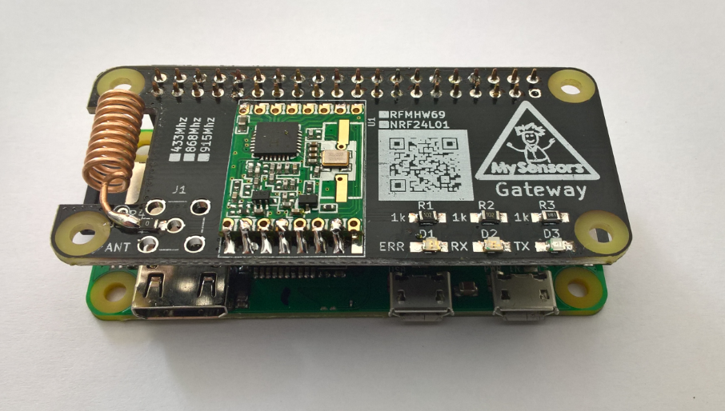
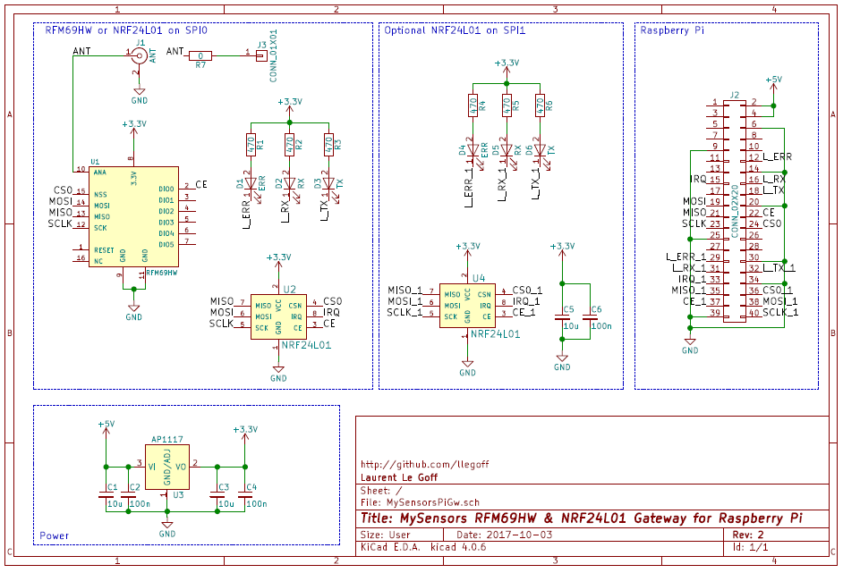
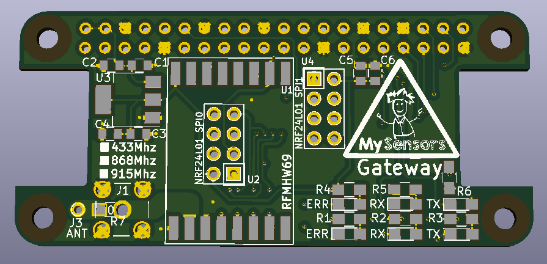
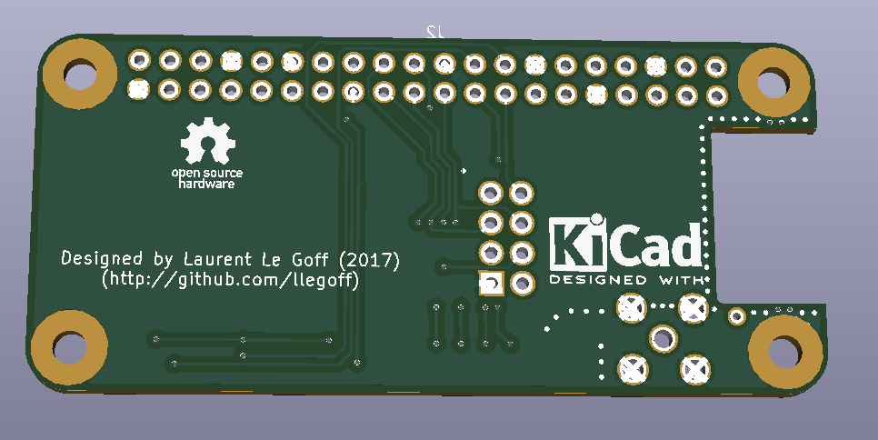

MySensorsPiGw
=============
MySensors RFM69 &amp; NRF24L Gateway for Raspberry Pi (zero &amp; B)

see
https://www.mysensors.org/build/raspberry

revision:

v1
- bad width of antenna track

v2
- change width of antenna track
- add 3.3v regulator
- add C1, C2, C3, C4

v3 
- add second NRF24L01 on SPI1
- add capacitor C5 C6
- add status leds D4 D5 D6
- change J3 position

Schema
-------

PCB
---

RFM69HW 
-------
RFM69HW is connected to SPI0

Download dev branch

    git clone https://github.com/mysensors/MySensors.git --branch development
    cd MySensors

configure (Ethernet gateway)

    ./configure --my-transport=rfm69 --my-rfm69-frequency=868 --my-is-rfm69hw --my-port=5003 --my-leds-err-pin=12 --my-leds-rx-pin=16 --my-leds-tx-pin=18
    make
    
running

    sudo ./bin/mysgw -d
    
install

    sudo make install
    
NRF24L01 on SPI0
----------------
Download master branch

    git clone https://github.com/mysensors/MySensors.git --branch master
    cd MySensors

configure (Ethernet gateway)

    ./configure --my-transport=nrf24 --my-rf24-irq-pin=15 --my-port=5003 --my-leds-err-pin=12 --my-leds-rx-pin=16 --my-leds-tx-pin=18
    make

running

    sudo ./bin/mysgw -d

install

    sudo make install

NRF24L01 on SPI1
----------------

It's experimental, see https://forum.mysensors.org/topic/7702/double-spi-radio-raspberry-pi

in /boot/config.txt add 

    //*** uncomment for pi3 & pi zero W ***
    //dtoverlay=pi3-disable-bt
    
    dtparam=spi=on
    //change spi1 cs0 to gpio16 pin 36
    dtoverlay=spi1-1cs,cs0_pin=16  

copy the source

    cp -r MySensors MySensorsSecond
    cd MySensorsSecond

edit file `Makefile` : replace the string `mysgw` by `mysgwSecond`

rename file `example_linux/mysgw.cpp` by `mysgwSecond.cpp`

configure the second instance 

    ./configure --my-transport=nrf24 --my-rf24-irq-pin=33 --my-rf24-ce-pin=37 --my-rf24-cs-pin=36 --spi-spidev-device=/dev/spidev1.0 --spi-driver=SPIDEV --my-port=5004 --my-leds-err-pin=29 --my-leds-rx-pin=31 --my-leds-tx-pin=32
    make
    
running

    sudo ./bin/mysgwSecond -d
    
install

    sudo make install
